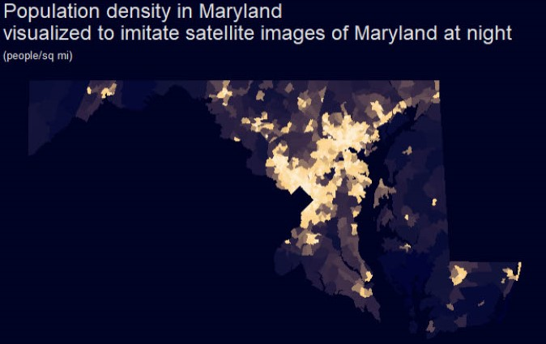
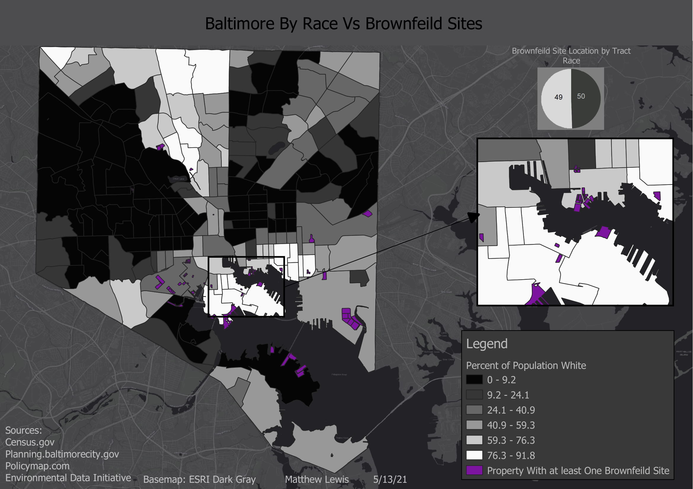
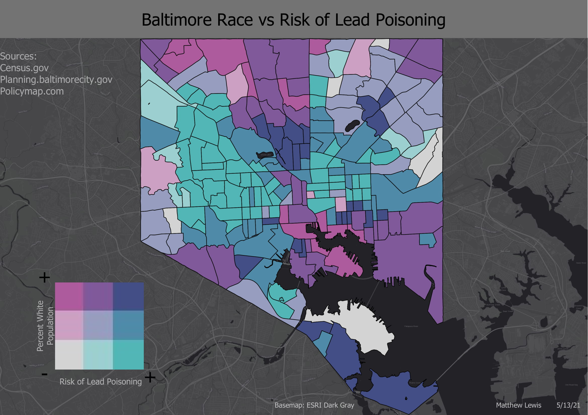

## Portfolio

---

### [Population Density Map of Maryland]()
Made using R Studio

---
### [Heatmap of Global Earthquakes from 1971 - 2015]()
Made using QGIS

---
### [Origin of Incoming UMBC Freshmen 2019]()
Made using ArcGIS

---

### [Location of Brownfield Sites in Baltimore City Against Racial Breakdown]()
Made using QGIS

---

### [Risk of Lead Poisoning Compared to Racial Breakdown in Baltimore City]()
Made using QGIS

---

<a href="https://ridgeway.github.io/GISFINAL/" title="About Me">GIS 486 Final Project</a>
 
<a href="https://github.com/Ridgeway/GISFINAL/" title="About Me">GIS 486 Final Project Backend</a>

---

---

Page template forked from <a href="https://github.com/evanca/quick-portfolio">evanca</a>

<!-- Remove above link if you don't want to attibute -->
