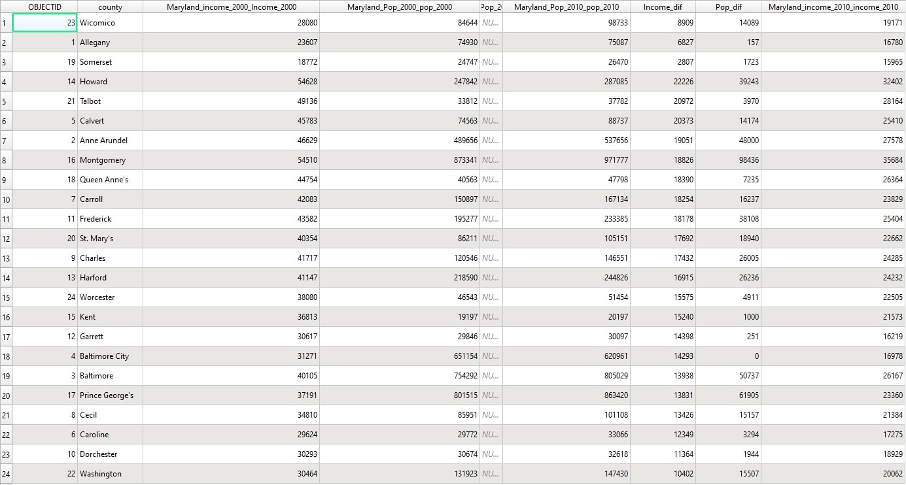
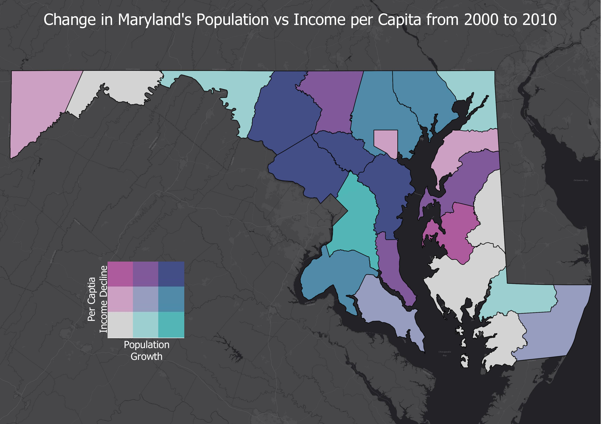

# Lab 6


---
## In R I first activated all the libraries I might need and input my Census API key.

```{r}


library(devtools)
library(sp)
library(rgdal)
library(maptools)
library(stringr)
library(scales)
library(tidyverse)
library(tidycensus)
dev_mode(on = T)


census_api_key("Your_api_key_here", overwrite = FALSE, install = TRUE)

```

## I used tidycensus to downloaded population data for maryland counties from the years 2010 and 2000, and saved them as a CSV.

```{r}

md_state_pop_2010 <- get_decennial(geography = "county", variables = "P001001", state = "MD", year = 2010 )

md_state_pop_2000 <- get_decennial(geography = "county", variables = "P001001", state = "MD", year = 2000 )

md_state_pop_2010
md_state_pop_2000

write.table(md_state_pop_2000, file="Maryland_Pop_2000.csv", sep=",")
write.table(md_state_pop_2010, file="Maryland_Pop_2010.csv", sep=",")
```

## I loaded the csv's in QGIS with Two more CSVs containing income per capita data, then used the feild calculator to calculate the changed between the years.



---
## Finally I created a choropleth map of using the data I calculated.




---


---
<p style="font-size:11px">Page template forked from <a href="https://github.com/evanca/quick-portfolio">evanca</a></p>
<!-- Remove above link if you don't want to attibute -->
